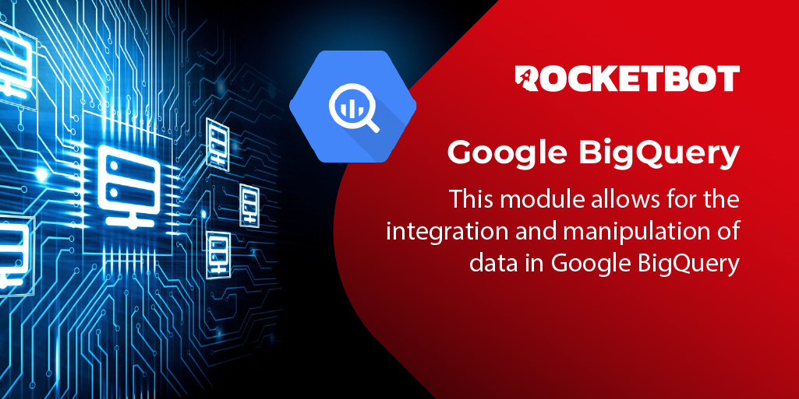

# BigQuery
  
This module allows for the integration and manipulation of data in Google BigQuery.  

*Read this in other languages: [English](Manual_BigQuery.md), [Português](Manual_BigQuery.pr.md), [Español](Manual_BigQuery.es.md)*
  

## How to install this module
  
To install the module in Rocketbot Studio, it can be done in two ways:
1. Manual: __Download__ the .zip file and unzip it in the modules folder. The folder name must be the same as the module and inside it must have the following files and folders: \__init__.py, package.json, docs, example and libs. If you have the application open, refresh your browser to be able to use the new module.
2. Automatic: When entering Rocketbot Studio on the right margin you will find the **Addons** section, select **Install Mods**, search for the desired module and press install.  

## How to use this module

Before using this module, you must have a Gmail account to access Google Cloud:

1. **Access the Google Cloud portal**
- Go to https://console.cloud.google.com/
- Log in to the Google Cloud Console.
- If this is your first time, you will be asked to accept the terms and conditions.

2. **Create a new project**
- At the top of the console, click the project selector.
- Click "New project."
- Give the project a name.
- Select an organization (if applicable) or leave the default option.
- Click "Create."

3. **Enable the Google Cloud Storage API**
- In the Google Cloud Console search bar, type "APIs & Services" and enter that section:
- Click "Enable APIs and services."
- Search for "BigQuery API" and enable it.

4. **Create a service account**

- In the Google Cloud console, search for and select "IAM & Admin" → "Service Accounts"
- Click "Create service account."
- Specify a name and description for the service account.
- Assign the required role:
- Under 
"Select a role," search for "BigQuery Admin."
- BigQuery Admin.
- This role grants permissions to manage all BigQuery resources and data.
- Continue and click "Create."

5. **Generate a service account key**
- In the created service account, go to the "Keys" tab.
- Click "Add Key" -> "Create new key."
- Select the JSON format (recommended).
- Download the generated JSON file and save it in a safe place.

## Description of the commands

### Setup Google Cloud BigQuery credentials
  
Configure Cloud BigQuery credentials
|Parameters|Description|example|
| --- | --- | --- |
|Credentials file path|Google Cloud BigQuery credentials file path|C:\Usuario\Desktop\credentials.json|

### Read data from BigQuery
  
Run an SQL query and get results
|Parameters|Description|example|
| --- | --- | --- |
|Query String|Consulta SQL|SELECT producto_id FROM proyecto_id.store.sell|
|Project ID|Project ID|bigquery-467823|
|Assign result to a Variable|Result|Variable|

### Load data
  
Load data from CSV file
|Parameters|Description|example|
| --- | --- | --- |
|Dataset ID|Dataset ID|dataset_id|
|Table ID|table_id|table_id|
|File path CSV|File path csv|C:\Usuario\Desktop\file.csv|
|Has Headers|Check if the .csv file has headers|True|
|Write disposition|The way the data will be loaded|WRITE_APPEND|
|Schema JSON|File path json|C:\Usuario\Desktop\schema.json|
|Project ID|Project ID|bigquery-467823|
|Assign result to a Variable|Result|Variable|
